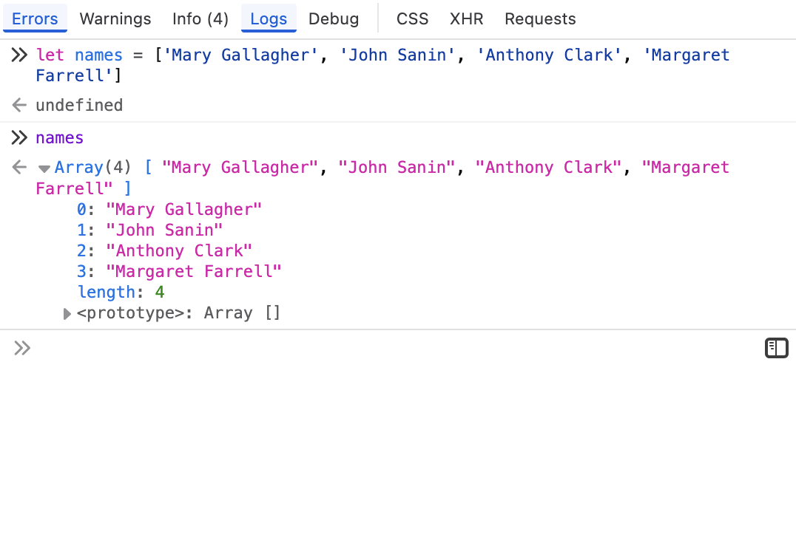
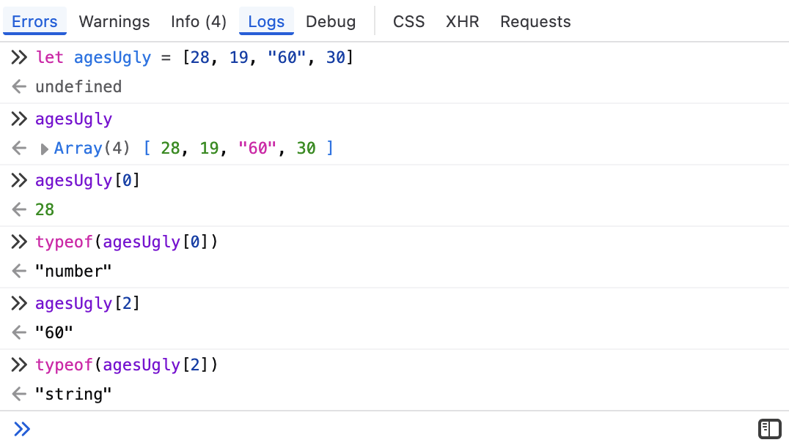

# 1.5 Lists (Arrays) and Loops

In the previous lesson, we used individual variables to represent some of the demographic information about the 19th century Irish immigrants featured in the [Bellevue Almshouse data](https://gih-nyc.org/almshouse/the-almshouse-records/), such as names.

```javascript
let person1Name = 'Marry Gallagher'
let person2Name = 'John Sanin'
```

It's typically more useful, however, to create a *collection* of values rather than individual variables.

One of the most common data collections in JS is an `Array []`, i.e., *list*. By using an array, we can put the names of the people featured in the dataset into a single collection.

A list is always enclosed by square brackets `[]` and accepts items in a row separated by commas (`,`).

```javascript
let names = ['Mary Gallagher', 'John Sanin', 'Anthony Clark', 'Margaret Farrell']
```

Open the console, copy the assignment above, then write `names`, so you can see its provided data type of `Array`.



Notice some of the features  about the Array data type that you can review in the console:

- Defines the position of each value in the list: 0-3.
- Length of the array, i.e., the number of items in the list: 4.
- If you click on `<prototype>`, you can see a list of prototype methods that you can call on any Array in JS, such as `push`, `sort`, etc.:
    - 

An array list can contain any combination of JS data types.

```javascript
let ages = [28, 19, 60, 30]

// While not a good practice to mix data types,
// here's an example where "60" is not a Number, but a String.
let agesUgly = [28, 19, "60", 30]
```

## 1.5.1 Array List Index

You can index a list like you would index a string.

For example, if we wanted to pull out the first item in our `names` list, we could put square brackets and our desired index number immediately after the list. Just like with strings, the JS index begins with 0.

Try it out in the console with the `ages` Array.

```javascript
ages[0] // 28
ages[2] // 60
```

Now, tinker around with the `agesUgly` array and see how there is indeed different data types.



## 1.5.2 Array List Methods

Array lists in JS also have a number of special methods that can be used with them. We will cover a few of the following:

- `.length` - How many items?
- `.slice()` - Cut up the items.
- `.reverse()` - Reverse the items.
- `.push()` - Insert item to end.
- `.splice()` - Insert item at specific index position.
- `.concat()` - Extend one Array by adding another at its end.
- Refer to MDN's JS Reference: "[Array methods and empty slots](https://developer.mozilla.org/en-US/docs/Web/JavaScript/Reference/Global_Objects/Array#array_methods_and_empty_slots)" for a more comprehensive review of Array list methods.

### Length &amp; Slice

You can easily retrieve the length of a array list with the `.length` method.

```javascript
let moreNames = [
  'Unity', 'Catherine', 'Thomas', 'William', 'Patrick',
  'Mary Anne', 'Morris', 'Michael', 'Ellen', 'James'
]

moreNames.length // 10
```

You can also slice lists like you can slice a string by using the `.slice()` method. It takes two parameters:

1. Starting index position
2. Cutoff index position. It will not include the item in this numbered position, but the item before it.

| Slice | Explanation | Output  |
|-------|-------------|---------|
| `moreNames.slice(0,2)`  | Slice list up to 2nd item | `['Unity', 'Catherine']`|
| `moreNames.slice(2,)`  | Slice from 2nd item to end of list  | `['Thomas', 'William', 'Patrick', 'Mary Anne', 'Morris', 'Michael', 'Ellen', 'James']`  |
| `moreNames.slice(2,5)` | Slice from 2 up until 5th item  | `[ "Thomas", "William", "Patrick" ]` |

### Reverse

The `.reverse()` method does just that: reverses the order of all items.

```javascript
moreNames.reverse()
// Output: [ "James", "Ellen", "Michael", "Morris", "Mary Anne", "Patrick", "William", "Thomas", "Catherine", "Unity" ]
```

### Add another item with .push()

If you need to add another item to the array list, use `.push()`. The item will be appended to the end of the array.

```javascript
ages.push(44)
```

### Alter contents with .splice()

The .splice() method changes the contents of an array by removing or replacing existing elements and/or adding new elements in place.

The method accepts the following parameters: `arrayListName.splice(start, deleteCount, item1, item2, /* …, */ itemN)`

```javascript
let moreAges = [22, 53, 21, 55]
moreAges.splice(1, 0, 33, 44)
// Result: [22, 33, 44, 53, 21, 55]
```

### Extend array lists with .concat()

Merge two or more arrays with the `.concat()` method. This method does not change the existing arrays, but instead returns a new array.

```javascript
let moreAges = [22, 53, 21, 55]
let evenMoreAges = [1, 2, 3, 4]
let concatAges = moreAges.concat(evenMoreAges)
// Result: concatAges == [22, 53, 21, 55, 1, 2, 3, 4]
```

## 1.5.3 For Loops

One of the best ways to work with a list is with `for` loops. This is a way of considering each item in the list or "iterating" through the list.

In JS, there are multiple FOR looping methods. For now, we'll focus on `for () {}`. This for looping approach uses the parantheses to create a variable name that operates like a key, but it really just becomes the index position.

```javascript
let names = ['Mary Gallagher', 'John Sanin(?)', 'Anthony Clark', 'Margaret Farrell']

for (const name in names) {
  console.log(name, "--", "Person's name is", names[name])
}
```

Output:


## 1.5.4 For Loops with Conditions

Now you can combine for loops and conditionals to create more dynamic results.

Let's log any ages less than 30.

```javascript
let ages = [22, 53, 21, 55]

for (const a in ages) {
  if (ages[a] < 30) {
    console.log(ages[a], "-- Young whipper snappers!")
  }
  else {
    console.log(ages[a], "-- Huh. What is old, really?")
  }
}
```

Output:


## Exercises with Lists &amp; Loops

Goals:

Be sure to convert all javascript codeblocks to executable blocks with the `js` notation.

Let's use the following array lists for these exercises, so be sure to convert this codeblock to `js`.

```javascript
let professions = ['married', 'laborer', 'widow', 'laborer', ]
let childStatus = ['Child Alana 10 days', 'Catherine 2 mos', '', 'Charles Riley afed 10 days' ]
let sex = ['f', 'm', 'f', 'm', 'i']
```

### E 1.5.1

Using a for loop and a conditional statement, remove the second item in the list `professions`.

**Remember that the index begins with 0!**.

For this first exercise, I'll provide you with the basic structure:

```javascript
for () {
  if () {
    console.log()
  }
}
```

### E 1.5.2

Add the item "spinster" to your `professions` list, then print the list.

```javascript
// Your code here
```

### E 1.5.3

Make a `for` loop that considers each item in the `professions` list and prints "Person's profession is ___"

```javascript
// Your code here
```

### E 1.5.4

Remove the fourth item in the `childStatus` list.

```javascript
// Your code here
```

### E 1.5.5

Make a `for` loop that considers each item in the `childStatus` list. Print "Person has child" ***if*** the person has a child ***and*** "Person does not have child" ***if not***.

```javascript
// Your code here
```
### E 1.5.6

Add an item to the list `sex` called "unknown".

```javascript
// Your code here
```

### E 1.5.7

Make a `for` loop that considers each item in the `sex` list.

Log "Person is male" ***if*** the person is `"m"`, "Person is female" ***if*** the person is `"f"`, "Person is intersex" ***if*** the person is `"i"`, and "Person's sex is not known" ***if*** `"unknown"`.

```javascript
// Your code here
```
